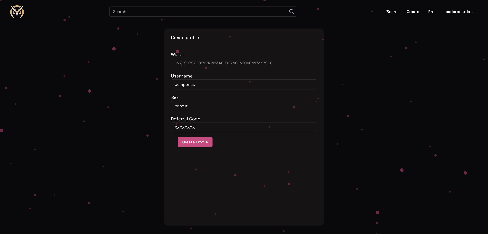
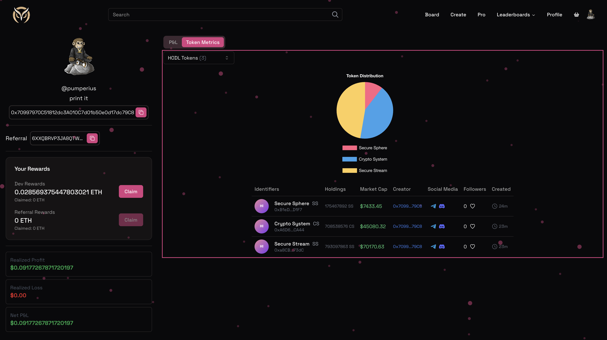

# Profiles

## Create a profile

When joining the platform for the first time, you will need to create a profile. All you need to do is connect your wallet and pick a username and description, and in case you have been referred by another user, you will need to enter the referral code of the user who referred you.

<!--
## Edit your profile

You can edit your profile by clicking on the profile button at the top right of the screen. On the profile page, you can change your username and description. -->

## Profile Analytics

And of course there's lots of cool features on your profile page:

- Display of tokens you created or are holding
- Your PnL over time
- Your leaderboard rank and any badges associated with your position
- Referral metrics
- Claim functionality for your rewards

