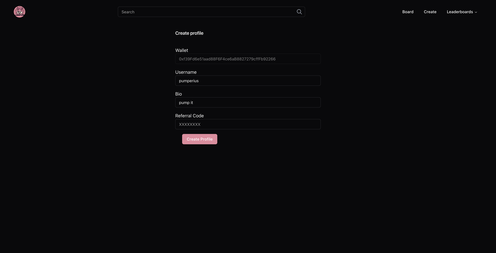
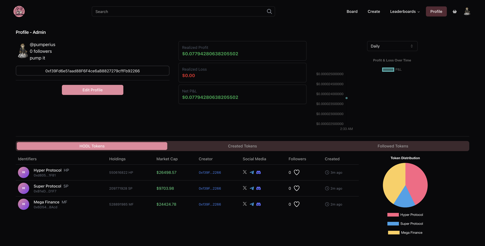

# Profiles

## Create a profile

When joining the platform for the first time, you will need to create a profile. This profile will be used to track your trading activity and rewards. All you need to do is connect your wallet and pick a username and description, and in case you have been referred by another user, you will need to enter the referral code of the user who referred you.

## Edit your profile

You can edit your profile by clicking on the profile button at the top right of the screen. On the profile page, you can change your username and description.

## Profile Analytics

On your profile page, you can see key metrics such as your PnL, volume, and rank, together with tokens you are holding or have created.

