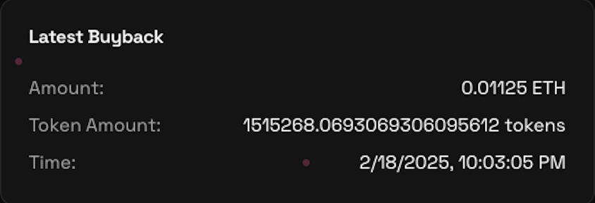

# Buyback & Burn

Buybacks are a way to reward the community for their loyalty and support. 🔥

## How it works

- **25%** of all trading fees generated by a particular tokenare added to the buyback pool.

- Once hitting 4.5 ETH in bonding curve liquidity, the buyback mechanism will place a buy order for all the ETH in the buyback pool and burn all the received tokens.

