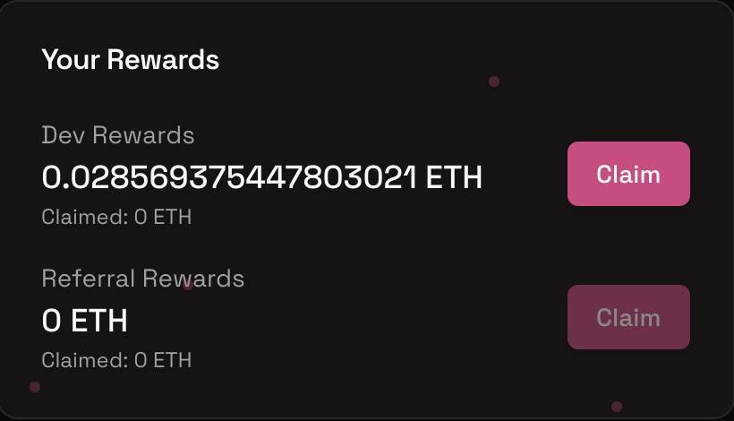

# Dev Rewards

Devs are truly the backbone of every meme token out there. They are the ones who create the tokens that everyone wants to trade. And they are the ones who will be rewarded for their work.

That's why we've created the **Dev Rewards** program.

## How it works

- Creators receive **25%** of the trading fees generated by their token during the bonding curve period.

- Once the token is deployed to Uniswap, devs also receive **40%** of the graduation fee of 0.33 ETH.

## Claiming your rewards

Creators can claim their rewards at any time on their profile page.

<!-- ## Points System

We want to reward everyone for their platform activity, therefore, users will accumulate points for their activity, which will be used to determine their rewards. The main actions to earn points are:

- Being the creator of a token that has been deployed to Uniswap, which helps you climb the creator leaderboard
- Generating trading volume, which helps you climb the volume leaderboard
- Deploy your best trading strategies and climb the PnL leaderboard

## Distributing rewards

Is it still yet to be determined how the points will be distributed and what the points/ETH ratio will be. -->
