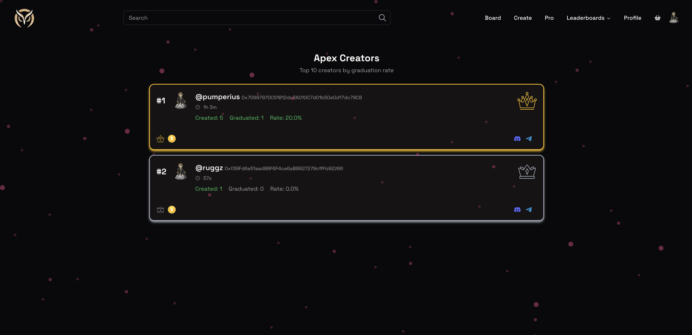
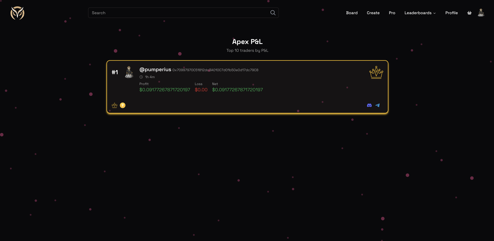
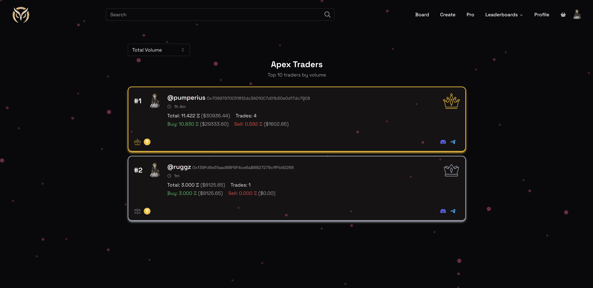

# Leaderboards

We implemented couple of leaderboards to help people compete and display their achievements among the community. Top of the leaderboards will receive badges which will be displayed on their profile and help them stand out from the crowd.

## Creator Leaderboard

The creator leaderboard is a leaderboard that displays the top creators of tokens on the platform. This tracks both the number of deployed tokens and how many of these tokens have been deployed to Uniswap.

## PnL Leaderboard

The PnL leaderboard is a leaderboard that displays the top traders on the platform based on their PnL. This tracks the PnL of all traders on the platform and displays the top traders.

## Volume Leaderboard

The volume leaderboard is a leaderboard that displays the top traders on the platform based on their trading volume.

<!-- ## Referral Leaderboard

The referral leaderboard is a leaderboard that displays the top referrers on the platform based on the number of users they have referred.

Read more about the [Referrals](/docs/rewards/referrals) system. -->
