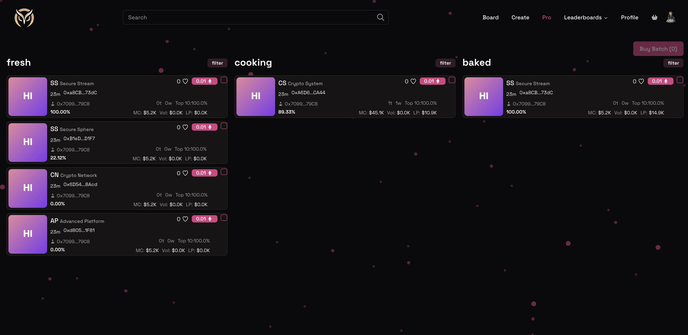
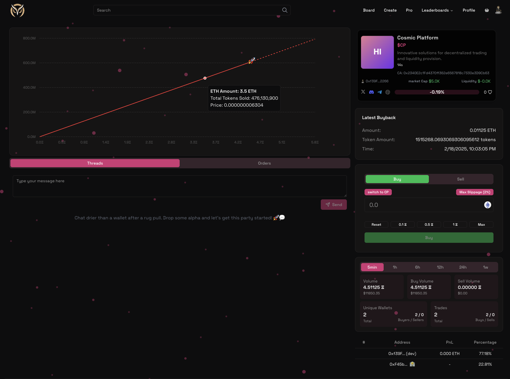

# Analytics

## Pro Trading Mode

A separated trading mode for the real degens. Here you're able to:

- snipe newly created tokens
- view tokens that are almost graduating
- view tokens that are already graduated
- instant buy any token
- easily buy in batch
- token analytics made easy

## Token Page Analytics

Key metrics for each token are available on the token page, including:

- Volume
- Price
- Liquidity
- Market Cap
- Holder Distribution
- Unrealised PnL

