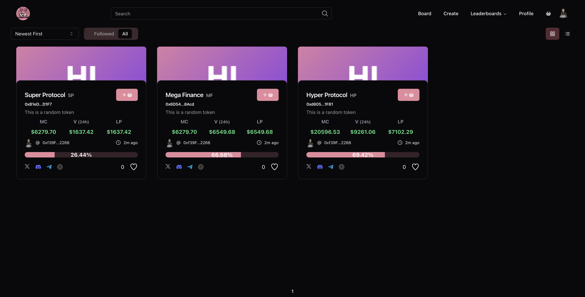
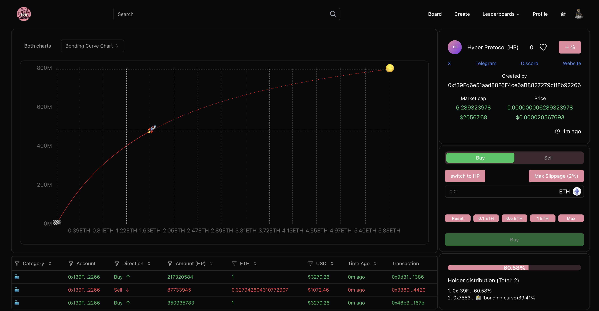

# Bonding Curves

Bonding Curves are the core of Lunipump. These have been carefully designed in-house to provide the best trading experience on Unichain.

## Types

There are 2 main types of bonding curves, and the type can be chosen when creating a token:

- **Logarithmic Bonding Curve**: This is the default type of bonding curve. Similar to the one on pump.fun, this curve ensured that price modifies based on demand and early buyers are incentivised.

- **Fair Distribution Curve**: This curve represents a mechanism where the price is fixed and allows for a fair distribution of the tokens.

## How it works

### Creation

On token creation, an associated bonding curve is created and mints 1 billion tokens which will be used for trading.

The initial Market Cap of a Bonding Curve is approximately 2 ETH.

The tokens have an approximate starting price of 0.000002 ETH.

All tokens can be viewed on the main dashboard.

### Trading

Users can buy tokens by depositing ETH into the bonding curve. The price of the tokens is determined by the bonding curve formula.

Similarly, users can sell their tokens back to the bonding curve and receive ETH in return.

Both activities are subject to a fee which can be found in the [Fees](/docs/trading/fees) section.

### Deployment

Once there is 5.83 ETH in the bonding curve, the curve is filled and the remaining 200M tokens are deposited to the Uniswap pool, together with 5.55 ETH from the curve. The LP tokens are being used ot generate yield from the liquidity pool and will be used for further DeFi applications in the future.
